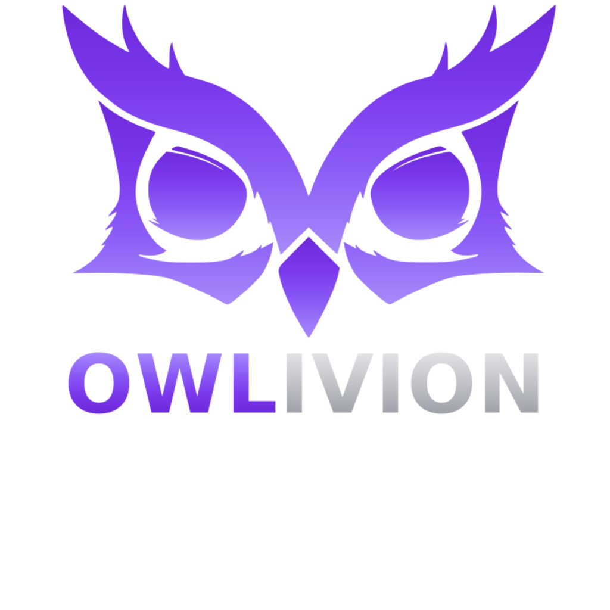

<p align="center">
  
</p>

<h1 align="center">Owlivion Mail</h1>

<p align="center">
  <strong>Akıllı, Güvenli, Özgür E-posta İstemcisi</strong>
</p>

<p align="center">
  <a href="https://github.com/babafpv/owlivion-mail/releases"></a>
  <a href="https://github.com/babafpv/owlivion-mail/blob/main/LICENSE"></a>
  <a href="https://github.com/babafpv/owlivion-mail/stargazers"></a>
  <a href="https://owlivion.com/mail"></a>
</p>

<p align="center">
  <a href="#özellikler">Özellikler</a> •
  <a href="#kurulum">Kurulum</a> •
  <a href="#desteklenen-servisler">Desteklenen Servisler</a> •
  <a href="#geliştirme">Geliştirme</a> •
  <a href="#güvenlik">Güvenlik</a> •
  <a href="#katkıda-bulunma">Katkıda Bulunma</a>
</p>

---

## Hakkında

Owlivion Mail, gizliliğinize saygı duyan, yapay zeka destekli açık kaynak masaüstü e-posta istemcisidir. Phishing saldırılarını tespit eder, takip piksellerini engeller ve şifrelerinizi güvenle saklar.

**Sonsuza kadar ücretsiz. Reklamsız. Açık kaynak.**

## Özellikler

### 🤖 AI Destekli Phishing Tespiti
- Google Gemini AI ile gerçek zamanlı e-posta analizi
- Şüpheli bağlantı ve içerik tespiti
- Risk seviyesi değerlendirmesi (Düşük/Orta/Yüksek/Kritik)
- Kural tabanlı yedek sistem (API olmadan da çalışır)

### 🛡️ Takip Pikseli Engelleme
- 60+ pazarlama servisi tanıma (Mailchimp, SendGrid, HubSpot, vb.)
- Otomatik takip pikseli tespiti
- Okundu bilgisi gönderimini engelleme
- Gizlilik koruması

### 🔐 Uçtan Uca Güvenlik
- **AES-256-GCM** şifreleme
- **HKDF** anahtar türetme
- Şifrelerin bellekten otomatik silinmesi (Zeroize)
- Makine bazlı anahtar üretimi
- SSL/TLS zorunluluğu (güvensiz bağlantı yok)

### 📧 E-posta Yönetimi
- Çoklu hesap desteği
- Birleşik gelen kutusu
- Klasör yönetimi (IMAP)
- E-posta yıldızlama
- Arama (FTS5 tam metin arama)
- HTML ve düz metin görüntüleme

### 🎨 Modern Arayüz
- Karanlık/Aydınlık tema
- Türkçe ve İngilizce dil desteği
- Duyarlı tasarım
- Klavye kısayolları

### ⚡ Performans
- Rust backend (hızlı ve güvenli)
- SQLite veritabanı
- Asenkron IMAP/SMTP
- Düşük bellek kullanımı

## Ekran Görüntüleri

<p align="center">
  
</p>

## Kurulum

### Hazır İndirme

[Releases](https://github.com/babafpv/owlivion-mail/releases) sayfasından işletim sisteminize uygun sürümü indirin:

| Platform | İndirme |
|----------|---------|
| Windows | `owlivion-mail_x.x.x_x64-setup.exe` |
| macOS | `owlivion-mail_x.x.x_x64.dmg` |
| Linux (deb) | `owlivion-mail_x.x.x_amd64.deb` |
| Linux (AppImage) | `owlivion-mail_x.x.x_amd64.AppImage` |

### Kaynaktan Derleme

#### Gereksinimler

- [Node.js](https://nodejs.org/) (v18+)
- [pnpm](https://pnpm.io/) (v8+)
- [Rust](https://rustup.rs/) (1.70+)
- Tauri CLI: `cargo install tauri-cli`

#### Adımlar

```bash
# Repoyu klonla
git clone https://github.com/babafpv/owlivion-mail.git
cd owlivion-mail

# Bağımlılıkları yükle
pnpm install

# Geliştirme modunda çalıştır
pnpm tauri dev

# Üretim için derle
pnpm tauri build
```

## Desteklenen Servisler

Owlivion Mail, IMAP/SMTP destekleyen tüm e-posta servisleriyle çalışır:

| Servis | IMAP | SMTP | Otomatik Yapılandırma |
|--------|------|------|----------------------|
| Gmail | ✅ | ✅ | ✅ |
| Outlook/Hotmail | ✅ | ✅ | ✅ |
| Yahoo Mail | ✅ | ✅ | ✅ |
| iCloud Mail | ✅ | ✅ | ✅ |
| Yandex Mail | ✅ | ✅ | ✅ |
| GMX | ✅ | ✅ | ✅ |
| Zoho Mail | ✅ | ✅ | ✅ |
| FastMail | ✅ | ✅ | ✅ |
| Mailbox.org | ✅ | ✅ | ✅ |
| Tutanota | ❌ | ❌ | - |
| ProtonMail | ⚠️ | ⚠️ | Bridge gerekli |

**+40 diğer servis** otomatik yapılandırma ile desteklenir.

> **Not:** Gmail ve diğer Google hesapları için [Uygulama Şifresi](https://myaccount.google.com/apppasswords) oluşturmanız gerekir.

## Yapılandırma

### AI Phishing Tespiti (Opsiyonel)

Gemini AI ile phishing tespiti için:

1. [Google AI Studio](https://aistudio.google.com/app/apikey) adresinden API anahtarı alın
2. Ayarlar → AI Ayarları → Gemini API Key alanına yapıştırın

> API anahtarı olmadan da kural tabanlı tespit çalışır.

### Dil Ayarı

Ayarlar → Genel → Dil menüsünden Türkçe veya İngilizce seçebilirsiniz.

### Tema

Ayarlar → Görünüm → Tema menüsünden Karanlık veya Aydınlık tema seçebilirsiniz.

## Güvenlik

### Şifreleme Detayları

```
Algoritma: AES-256-GCM
Anahtar Türetme: HKDF-SHA256
Nonce: 12 byte rastgele
Salt: 32 byte kurulum bazlı
Anahtar Kaynağı: Makine ID + Kullanıcı + Salt
```

### Güvenlik Özellikleri

- ✅ Şifreler veritabanında şifreli saklanır
- ✅ Şifreler kullanım sonrası bellekten silinir (zeroize)
- ✅ SSL/TLS zorunlu (güvensiz bağlantı engellendi)
- ✅ SSRF koruması (localhost/private IP engeli)
- ✅ Rate limiting (brute force koruması)
- ✅ SQL injection koruması (FTS5 sanitization)
- ✅ Hassas bilgiler loglara yazılmaz

### Güvenlik Açığı Bildirimi

Güvenlik açığı bulduysanız lütfen [security@owlivion.com](mailto:security@owlivion.com) adresine bildirin.

## Geliştirme

### Proje Yapısı

```
owlivion-mail/
├── src/                    # React frontend
│   ├── components/         # UI bileşenleri
│   ├── services/           # API servisleri
│   └── App.tsx             # Ana uygulama
├── src-tauri/              # Rust backend
│   ├── src/
│   │   ├── main.rs         # Giriş noktası
│   │   ├── lib.rs          # Tauri komutları
│   │   ├── db/             # SQLite veritabanı
│   │   ├── mail/           # IMAP/SMTP işlemleri
│   │   └── crypto.rs       # Şifreleme
│   └── Cargo.toml
├── landing/                # Web sitesi
└── package.json
```

### Teknolojiler

**Frontend:**
- React 18
- TypeScript
- Vite
- TailwindCSS

**Backend:**
- Rust
- Tauri v2
- SQLite (rusqlite)
- async-imap / async-smtp
- ring (kriptografi)

### Komutlar

```bash
# Geliştirme
pnpm tauri dev

# Lint
pnpm lint

# Format
pnpm format

# Test (Rust)
cd src-tauri && cargo test

# Build
pnpm tauri build
```

## Katkıda Bulunma

Katkılarınızı bekliyoruz!

1. Fork edin
2. Feature branch oluşturun (`git checkout -b feature/yeni-ozellik`)
3. Değişikliklerinizi commit edin (`git commit -m 'Yeni özellik eklendi'`)
4. Branch'i push edin (`git push origin feature/yeni-ozellik`)
5. Pull Request açın

### Geliştirme Kuralları

- Kod Türkçe yorum içerebilir
- Commit mesajları İngilizce veya Türkçe olabilir
- PR açmadan önce `pnpm lint` çalıştırın
- Güvenlik değişiklikleri için detaylı açıklama ekleyin

## Yol Haritası

- [ ] E-posta oluşturma/yanıtlama
- [ ] Takvim entegrasyonu
- [ ] Kişiler yönetimi
- [ ] PGP şifreleme
- [ ] Mobil uygulama (iOS/Android)
- [ ] Çoklu cihaz senkronizasyonu

## SSS

<details>
<summary><strong>Gmail ile bağlanamıyorum</strong></summary>

Gmail için normal şifreniz yerine [Uygulama Şifresi](https://myaccount.google.com/apppasswords) kullanmanız gerekir. 2FA aktif olmalıdır.
</details>

<details>
<summary><strong>Verilerim nerede saklanıyor?</strong></summary>

Tüm veriler yerel bilgisayarınızda saklanır:
- Windows: `%APPDATA%\com.owlivion.owlivion-mail`
- macOS: `~/Library/Application Support/com.owlivion.owlivion-mail`
- Linux: `~/.local/share/com.owlivion.owlivion-mail`
</details>

<details>
<summary><strong>Şifrelerim güvende mi?</strong></summary>

Evet. Şifreleriniz AES-256-GCM ile şifrelenir ve sadece sizin bilgisayarınızda çözülebilir. Şifreleme anahtarı makine bazlı üretilir.
</details>

<details>
<summary><strong>İnternet olmadan çalışır mı?</strong></summary>

Daha önce indirilen e-postalar çevrimdışı okunabilir. Yeni e-posta almak/göndermek için internet gerekir.
</details>

## Lisans

Bu proje [MIT Lisansı](LICENSE) ile lisanslanmıştır.

```
MIT License - Özet:
✅ Ticari kullanım
✅ Değiştirme
✅ Dağıtım
✅ Özel kullanım
❌ Sorumluluk
❌ Garanti
```

## İletişim

- **Website:** [owlivion.com/mail](https://owlivion.com/mail)
- **GitHub:** [github.com/babafpv/owlivion-mail](https://github.com/babafpv/owlivion-mail)
- **E-posta:** [contact@owlivion.com](mailto:contact@owlivion.com)
- **Twitter:** [@owlivion](https://twitter.com/owlivion)

---

<p align="center">
  <strong>Owlivion</strong> tarafından ❤️ ile yapıldı
</p>

<p align="center">
  <a href="https://owlivion.com">owlivion.com</a>
</p>
